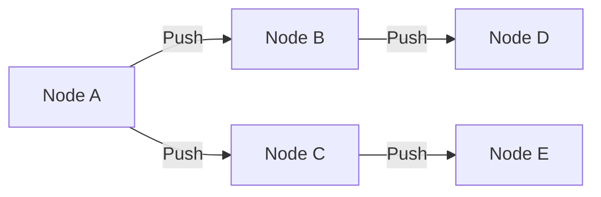

# Network Architecture of SAITO-Constrained HNN

## Overview

The SAITO-Constrained HNN operates as a decentralized P2P network where each node participates in computation, validation, and knowledge propagation. This document outlines the architectural components and communication protocols that enable efficient, scalable, and secure operation.

## Network Topology

### Node Types

1. **Validator Nodes**
   - Participate in consensus
   - Process transactions and update the state
   - Must stake SAITO tokens
   - Receive rewards for honest participation

2. **Worker Nodes**
   - Perform Hyperbolic Hebbian Learning computations
   - Process local subgraphs
   - Submit updates to validators
   - Can be lightweight or full nodes

3. **Client Nodes**
   - Submit transactions and queries
   - Do not participate in consensus
   - Can verify proofs of computation

### Network Layers

```
┌─────────────────────────────────────────────────┐
│                  Application Layer              │
│  • Hyperbolic Hebbian Learning                 │
│  • Economic Model                              │
│  • State Management                            │
└───────────────────────────┬─────────────────────┘
┌───────────────────────────▼─────────────────────┐
│                 Consensus Layer                 │
│  • Block Production                            │
│  • Finality Gadget                             │
│  • Fork Choice Rule                            │
└───────────────────────────┬─────────────────────┘
┌───────────────────────────▼─────────────────────┐
│                Networking Layer                 │
│  • Gossip Protocol                             │
│  • Peer Discovery                              │
│  • Message Routing                             │
└───────────────────────────┬─────────────────────┘
┌───────────────────────────▼─────────────────────┐
│                Transport Layer                  │
│  • Secure Channels (TLS/Noise)                 │
│  • Connection Pooling                          │
│  • NAT Traversal                               │
└─────────────────────────────────────────────────┘
```

## Communication Protocols

### 1. Gossip Protocol

Used for efficient message propagation across the network:



- **Push-Pull Gossip**: Combines push and pull for efficient state synchronization
- **Topic-Based**: Messages are categorized into topics for efficient filtering
- **Message Types**:
  - Transactions
  - Block proposals
  - State updates
  - Peer discovery

### 2. Consensus Protocol

A modified Proof-of-Stake (PoS) mechanism:

1. **Epoch-Based Operation**
   - Epoch length: 24 hours
   - Validator set rotates each epoch
   - Rewards distributed at epoch end

2. **Block Production**
   - Time-based slots (e.g., 6 seconds)
   - Validators take turns proposing blocks
   - At least 2/3+1 signatures required for finality

3. **Fork Resolution**
   - Longest chain rule with economic weight
   - Slashing for equivocation
   - Finality after 2/3+1 attestations

## Data Structures

### Block Structure

```rust
struct Block {
    header: BlockHeader,
    transactions: Vec<Transaction>,
    signature: Signature,
}

struct BlockHeader {
    parent_hash: Hash,
    state_root: Hash,
    transactions_root: Hash,
    timestamp: u64,
    slot: u64,
    proposer_index: u64,
    signature: Signature,
}
```

### Transaction Format

```rust
struct Transaction {
    // Transaction metadata
    nonce: u64,
    gas_limit: u64,
    max_fee_per_gas: u64,
    
    // Sender and recipient
    from: Address,
    to: Option<Address>,  // None for contract creation
    
    // Transaction data
    value: u128,
    data: Vec<u8>,
    
    // Signature
    v: u64,
    r: [u8; 32],
    s: [u8; 32],
}
```

## Network Parameters

| Parameter | Value | Description |
|-----------|-------|-------------|
| Max Block Size | 2 MB | Maximum size of a block |
| Block Time | 6s | Target time between blocks |
| Max Validators | 100 | Maximum number of active validators |
| Epoch Length | 8,192 slots (~13.65 hours) | Duration of an epoch |
| Min Stake | 10,000 ST | Minimum stake to become a validator |
| Slots per Epoch | 8,192 | Number of slots in an epoch |
| Committee Size | 128 | Number of validators per committee |

## Scalability Solutions

### 1. Sharding
- **Overview**: Horizontal partitioning of the state
- **Shard Count**: 64 shards
- **Cross-Shard Communication**: Asynchronous messaging

### 2. State Channels
- **Use Case**: High-frequency transactions
- **Implementation**: Bi-directional payment channels
- **Dispute Resolution**: On-chain challenge period

### 3. Rollups
- **Type**: ZK-Rollups for scaling computation
- **Throughput**: ~2,000 TPS per shard
- **Finality**: ~15 minutes

## Security Considerations

### 1. Sybil Resistance
- **Mechanism**: Proof-of-Stake with minimum stake requirement
- **Parameters**:
  - Minimum stake: 10,000 ST
  - Slashing: 5% of stake for misbehavior

### 2. Network-Level Attacks
- **Eclipse Attacks**: Defended against with random peer selection
- **DDoS Protection**: Rate limiting and proof-of-work for connection establishment
- **Man-in-the-Middle**: TLS 1.3 for all connections

### 3. Economic Security
- **Staking Requirements**: Minimum 32 ETH equivalent
- **Slashing Conditions**:
  - Double signing
  - Liveness violations
  - Invalid state transitions

## Implementation Roadmap

### Phase 1: Foundation
- [ ] Implement basic P2P networking
- [ ] Set up validator node software
- [ ] Deploy testnet with basic functionality

### Phase 2: Scaling
- [ ] Implement sharding
- [ ] Integrate state channels
- [ ] Optimize consensus for high throughput

### Phase 3: Production
- [ ] Security audits
- [ ] Mainnet launch
- [ ] Governance handover to community
