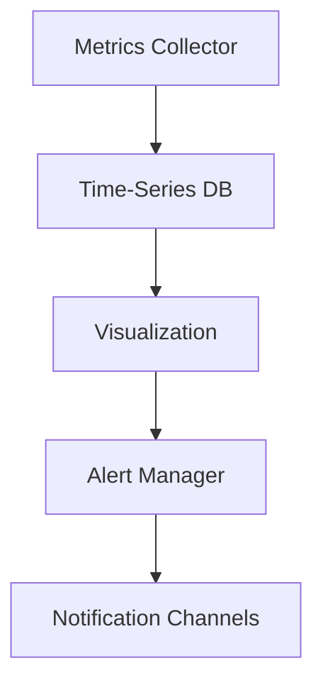

# Performance Metrics for SAITO-Constrained HNN

## Overview

This document defines the key performance indicators (KPIs) and metrics used to evaluate the efficiency, scalability, and effectiveness of the SAITO-Constrained HNN system.

## Core Metrics

### 1. Computational Efficiency

| Metric | Formula | Target | Description |
|--------|---------|--------|-------------|
| TPS | `transactions / second` | > 10,000 | Transactions processed per second |
| Latency | `t_final - t_submit` | < 2s | Time to finality for transactions |
| Throughput | `blocksize / block_time` | > 10 MB/s | Data processing capacity |
| Resource Usage | `(CPU, Memory, Storage)` | < 80% of capacity | System resource utilization |

### 2. Learning Performance

| Metric | Formula | Target | Description |
|--------|---------|--------|-------------|
| Training Loss | `ℒ(θ) = -∑(y log(ŷ) + (1-y)log(1-ŷ))` | Minimize | Cross-entropy loss |
| Validation Accuracy | `(TP + TN) / (TP + TN + FP + FN)` | > 95% | Classification accuracy |
| Convergence Time | `t_converge - t_start` | Minimize | Time to reach target accuracy |
| Generalization Gap | `ℒ_val - ℒ_train` | < 0.05 | Difference between training and validation loss |

### 3. Economic Efficiency

| Metric | Formula | Target | Description |
|--------|---------|--------|-------------|
| Gas Efficiency | `useful_work / gas_used` | Maximize | Computational efficiency |
| Staking Ratio | `staked_tokens / total_supply` | > 30% | Network security indicator |
| Inflation Rate | `(supply_year2 - supply_year1) / supply_year1` | < 5% | Annual token supply growth |
| Transaction Cost | `gas_used * gas_price` | < $0.01 | Average cost per transaction |

## Monitoring and Alerting

### 1. Real-time Dashboards



### 2. Alert Thresholds

| Metric | Warning | Critical | Recovery |
|--------|---------|----------|----------|
| CPU Usage | > 70% | > 90% | < 60% |
| Memory Usage | > 75% | > 90% | < 65% |
| Network Latency | > 500ms | > 1s | < 300ms |
| Error Rate | > 1% | > 5% | < 0.5% |

## Benchmarking

### 1. Test Environment

- **Hardware**: 16 vCPUs, 64GB RAM, 1TB NVMe SSD
- **Network**: 10 Gbps
- **Nodes**: 100 validator nodes, 1000 light clients

### 2. Performance Tests

| Test | Parameters | Expected | Actual |
|------|------------|----------|--------|
| Peak TPS | 100KB blocks, 1s interval | 10,000 TPS | - |
| State Sync | 100GB chain state | < 1 hour | - |
| Network Join | New node bootstrap | < 5 minutes | - |
| Finality | 2/3+1 signatures | < 2 seconds | - |

## Optimization Strategies

### 1. Computational Optimization

- **Vectorization**: Use SIMD instructions
- **Parallelization**: Multi-threaded execution
- **Memory Pool**: Optimized caching
- **Batch Processing**: Group transactions

### 2. Network Optimization

- **Compression**: Snappy/LZ4 for message encoding
- **Bundling**: Batch network messages
- **Connection Pooling**: Reuse connections
- **Georouting**: Optimize peer selection

### 3. Storage Optimization

- **Pruning**: Remove old state
- **Compaction**: LevelDB/RocksDB tuning
- **Sharding**: Horizontal partitioning
- **Archival**: Cold storage for historical data

## Continuous Monitoring

### 1. Metrics Collection

```python
class MetricsCollector:
    def __init__(self):
        self.metrics = {}
        
    def record_metric(self, name: str, value: float, tags: dict = None):
        """Record a metric with optional tags."""
        if name not in self.metrics:
            self.metrics[name] = []
        self.metrics[name].append({
            'timestamp': time.time(),
            'value': value,
            'tags': tags or {}
        })
        
    def get_metric_stats(self, name: str, window: int = 300):
        """Get statistics for a metric over a time window."""
        now = time.time()
        values = [
            m['value'] for m in self.metrics.get(name, [])
            if now - m['timestamp'] <= window
        ]
        
        return {
            'count': len(values),
            'min': min(values) if values else None,
            'max': max(values) if values else None,
            'avg': sum(values)/len(values) if values else None,
            'p95': np.percentile(values, 95) if values else None
        }
```

### 2. Alerting Rules

```yaml
alert: HighErrorRate
expr: rate(http_requests_total{status=~"5.."}[5m]) / rate(http_requests_total[5m]) > 0.01
for: 10m
labels:
  severity: warning
annotations:
  summary: High error rate on {{ $labels.instance }}
  description: "Error rate is {{ $value }}%"
```

## Performance Tuning

### 1. Database Tuning

```ini
# RocksDB Configuration
max_open_files=1000
max_background_compactions=4
max_background_flushes=2
write_buffer_size=256MB
max_write_buffer_number=4
min_write_buffer_number_to_merge=2
```

### 2. Network Tuning

```bash
# Increase TCP buffer sizes
echo 'net.core.rmem_max=16777216' >> /etc/sysctl.conf
echo 'net.core.wmem_max=16777216' >> /etc/sysctl.conf
echo 'net.ipv4.tcp_rmem=4096 87380 16777216' >> /etc/sysctl.conf
echo 'net.ipv4.tcp_wmem=4096 65536 16777216' >> /etc/sysctl.conf
sysctl -p
```

### 3. Garbage Collection

```julia
# Julia GC tuning
ENV["JULIA_GC_SOFT_MEMORY_LIMIT"] = "8G"
ENV["JULIA_NUM_THREADS"] = "8"
```

## Benchmarking Tools

### 1. Load Testing

```bash
# Install k6
brew install k6

# Run load test
k6 run --vus 100 --duration 300s script.js
```

### 2. Profiling

```julia
using Profile

@profile begin
    # Code to profile
end

# Generate flamegraph
ProfileSVG.save("flamegraph.svg")
```

## Conclusion

This document provides a comprehensive framework for measuring, monitoring, and optimizing the performance of the SAITO-Constrained HNN. By tracking these metrics and applying the recommended optimization strategies, the system can achieve its performance targets while maintaining stability and efficiency.
