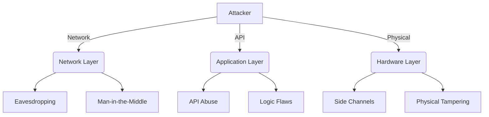

# Security Audit Framework for SAITO-Constrained HNN

## 1. Security Principles

### 1.1 Core Security Properties
- **Confidentiality**: Protect sensitive data
- **Integrity**: Ensure data consistency
- **Availability**: Maintain system resilience
- **Non-repudiation**: Ensure accountability
- **Privacy**: Protect user data

### 1.2 Threat Model


## 2. Audit Scope

### 2.1 In-Scope Components
- Cryptographic primitives
- Network protocols
- Consensus mechanism
- Smart contracts
- P2P communication
- Storage layer

### 2.2 Out-of-Scope
- Third-party dependencies
- Physical security
- Social engineering
- Client-side security

## 3. Testing Methodology

### 3.1 Static Analysis
```bash
# Run security linters
julia --project=. -e 'using Pkg; Pkg.add("JET"); using JET; report_file("src/core/hyperbolic.jl")'

# Check for common vulnerabilities
bandit -r src/
```

### 3.2 Dynamic Analysis
- **Fuzzing**: AFL++, libFuzzer
- **Runtime Analysis**: Valgrind, AddressSanitizer
- **Network Testing**: Wireshark, tcpdump

## 4. Vulnerability Classification

### 4.1 Severity Levels
| Level | Impact | Example |
|-------|--------|---------|
| Critical | System compromise | Private key leak |
| High | Unauthorized access | Bypass auth |
| Medium | Limited impact | DoS vector |
| Low | Minor issues | Logging |

### 4.2 Common Vulnerabilities
- **Cryptography**: Weak RNG, timing attacks
- **Networking**: Replay attacks, eclipse attacks
- **Consensus**: Nothing-at-stake, long-range attacks
- **Storage**: Injection, XSS, deserialization

## 5. Penetration Testing

### 5.1 Test Cases
```python
# Example test case
def test_replay_attack():
    tx = create_signed_tx()
    # Send same tx multiple times
    for _ in range(5):
        assert not node.submit_tx(tx)
```

### 5.2 Tools
- **Network**: Nmap, Metasploit
- **Fuzzers**: AFL++, libFuzzer
- **Blockchain**: Mythril, Slither
- **Web**: OWASP ZAP, Burp Suite

## 6. Code Review Checklist

### 6.1 Security-Sensitive Areas
- [ ] Cryptographic operations
- [ ] Memory management
- [ ] Network I/O
- [ ] Access control
- [ ] Error handling

### 6.2 Common Pitfalls
- [ ] Integer overflows
- [ ] Race conditions
- [ ] Unbounded loops
- [ ] Unchecked inputs

## 7. Incident Response

### 7.1 Response Plan
1. **Identification**: Detect and confirm incident
2. **Containment**: Limit impact
3. **Eradication**: Remove cause
4. **Recovery**: Restore services
5. **Lessons**: Post-mortem

### 7.2 Communication Plan
- Internal team: Immediate
- Users: 24 hours
- Public: 72 hours

## 8. Security Hardening

### 8.1 Compiler Flags
```julia
# Enable security flags
add_compile_flags([
    "-D_FORTIFY_SOURCE=2",
    "-fstack-protector-strong",
    "-Wformat",
    "-Werror=format-security"
])
```

### 8.2 Runtime Protections
- ASLR (Address Space Layout Randomization)
- DEP (Data Execution Prevention)
- Stack canaries
- Control Flow Integrity

## 9. Continuous Security

### 9.1 Automated Scanning
- **Dependencies**: Dependabot, Renovate
- **Secrets**: Git-secrets, TruffleHog
- **Containers**: Clair, Trivy

### 9.2 Monitoring
- **Logging**: Centralized logging
- **Metrics**: Prometheus, Grafana
- **Alerts**: PagerDuty, OpsGenie

## 10. Compliance

### 10.1 Standards
- OWASP Top 10
- NIST Cybersecurity Framework
- ISO/IEC 27001
- GDPR, CCPA

### 10.2 Documentation
- Security policy
- Risk assessment
- Audit reports
- Compliance certificates

## 11. Bug Bounty Program

### 11.1 Rewards
| Severity | Reward (USD) |
|----------|-------------:|
| Critical | $50,000     |
| High     | $10,000     |
| Medium   | $5,000      |
| Low      | $1,000      |

### 11.2 Scope and Rules
- Public testnet only
- No DoS testing
- Responsible disclosure
- First-come-first-served

## 12. Security Training

### 12.1 Topics
- Secure coding practices
- Threat modeling
- Cryptography
- Incident response

### 12.2 Resources
- OWASP guides
- Cryptopals challenges
- CTF competitions
- Security certifications
